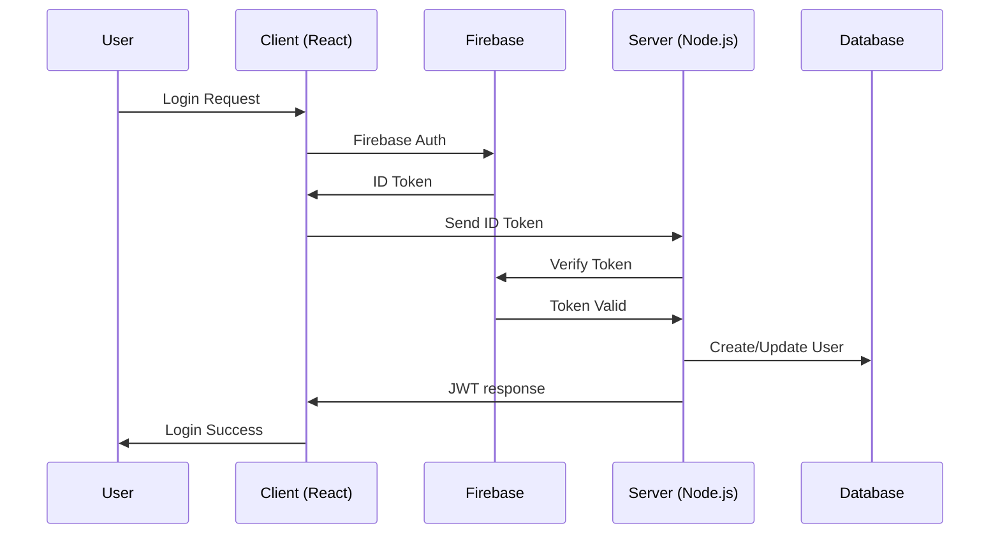

# 🛒 eStore Project - Modern E-Commerce Platform

> A full-stack e-commerce solution built with React 19 and Node.js, featuring seamless multi-language support, secure Google authentication, and an intuitive shopping experience.

[](https://mongodb.com/)
[](https://expressjs.org/)
[](https://nodejs.org/)
[](https://reactjs.org/)

## ✨ Key Features

### 🛍️ **Shopping Experience**

- **Smart Cart Management**: Add, remove, and update items with real-time calculations
- **Product Discovery**: Advanced search and category-based filtering
- **Order Processing**: Complete checkout flow with confirmation emails
- **Inventory Tracking**: Real-time stock management and availability

### 🎨 **Modern UI/UX**

- **Responsive Design**: Mobile-first approach with CSS Grid and Flexbox
- **Component-based Architecture**: Modular CSS with scoped styling
- **Dark/Light Theme**: Adaptive color schemes and user preferences
- **Accessibility**: WCAG 2.1 compliant with keyboard navigation

### 🌍 **Internationalization**

- **Multi-language Support**: Complete i18n implementation with English and Arabic
- **RTL Support**: Full right-to-left layout support for Arabic users
- **Dynamic Language Switching**: Seamless language transitions without page reload

### 🔐 **Advanced Authentication**

- **Google Integration**: Secure user authentication with Google sign-in
- **JWT Token Management**: Server-side token validation and refresh

### 🚀 **Performance & Reliability**

- **State Management**: Optimized Redux Toolkit with RTK Query
- **Code Splitting**: Lazy loading for improved performance
- **API Logging**: Comprehensive monitoring with Winston and Logtail
- **Error Handling**: Graceful error boundaries and user feedback

## 🏗️ Technology Stack

### Frontend Technologies

| Technology        | Version | Purpose                                  |
| ----------------- | ------- | ---------------------------------------- |
| **React**         | 19.x    | UI Framework with concurrent features    |
| **Vite**          | Latest  | Lightning-fast build tool and dev server |
| **Redux Toolkit** | Latest  | Predictable state management             |
| **React Router**  | v7      | Declarative routing                      |
| **React Intl**    | Latest  | Internationalization library             |
| **CSS Modules**   | -       | Scoped component styling                 |
| **Firebase**      | v11     | Authentication and hosting               |
| **Axios**         | Latest  | Promise-based HTTP client                |

### Backend Technologies

| Technology         | Version | Purpose                        |
| ------------------ | ------- | ------------------------------ |
| **Node.js**        | 18+     | JavaScript runtime environment |
| **Express.js**     | Latest  | Web application framework      |
| **MongoDB**        | 4.4+    | NoSQL database                 |
| **Mongoose**       | Latest  | MongoDB object modeling        |
| **Firebase Admin** | Latest  | Server-side Firebase SDK       |
| **JWT**            | Latest  | JSON Web Token implementation  |
| **Winston**        | Latest  | Logging library                |
| **CORS**           | Latest  | Cross-origin resource sharing  |

## � Project Architecture

```
estore-project/
├── 📱 client/                    # Frontend React Application
│   ├── 🎨 src/
│   │   ├── 🧩 components/        # Reusable UI components (Badge, Container, etc.)
│   │   ├── 📄 pages/             # Route-based page components
│   │   │   ├── home/             # Landing page with featured products
│   │   │   ├── shop/             # Product catalog and filtering
│   │   │   ├── product/          # Product detail views
│   │   │   ├── cart/             # Shopping cart management
│   │   │   ├── about/            # Company information
│   │   │   └── confirmation/     # Order success page
│   │   ├── 🏗️ layout/            # Layout components and structure
│   │   │   ├── components/       # Header, Footer, Navigation
│   │   │   ├── elements/         # Auth buttons, Language switcher
│   │   │   └── partials/         # Reusable layout sections
│   │   ├── 🔐 auth/              # Google authentication provider
│   │   ├── 🌐 i18n/              # Internationalization setup
│   │   │   └── messages/         # Translation files (en.json, ar.json)
│   │   ├── 📦 store/             # Redux Toolkit configuration
│   │   │   └── slices/           # Auth, Cart, Products state slices
│   │   ├── 🧭 routing/           # React Router configuration
│   │   └── 🔧 utils/             # Helper functions and utilities
│   ├── 🌐 public/                # Static assets
│   │   └── images/               # Icons, logos, and graphics
│   └── ⚙️ Config files           # Vite, ESLint, package.json
├── 🚀 server/                    # Backend API Server
│   ├── 🎮 controllers/           # Business logic handlers
│   │   ├── auth.controller.js    # Authentication endpoints
│   │   ├── product.controller.js # Product CRUD operations
│   │   ├── cart.controller.js    # Cart management
│   │   └── order.controller.js   # Order processing
│   ├── 🗄️ database/              # Database layer
│   │   ├── db.manager.js         # Connection and configuration
│   │   └── schemas/              # Mongoose models
│   ├── 🛡️ middleware/            # Express middleware
│   │   ├── auth.middleware.js    # JWT token validation
│   │   └── language.middleware.js# i18n request handling
│   ├── ⚠️ handlers/              # Error and 404 handling
│   ├── 🌍 i18n/                  # Server-side translations
│   ├── 📧 services/              # Email and external services
│   ├── 📝 logger/                # Winston logging configuration
│   └── ✅ validators/            # Request validation schemas
└── 📚 Documentation              # README, guides, and docs
```

## 🚀 Quick Start Guide

### 📋 Prerequisites

Before you begin, ensure you have the following installed:

- **Node.js** `v18.0.0` or higher ([Download](https://nodejs.org/))
- **npm** `v8.0.0` or higher (comes with Node.js)
- **MongoDB** `v4.4` or higher ([Download](https://www.mongodb.com/try/download/community))
- **Git** for version control ([Download](https://git-scm.com/))

### ⚡ Quick Setup

```bash
# Clone the repository
git clone https://github.com/wajedisleem/estore-project.git
cd estore-project

# Install client dependencies
cd client && npm install

# Install server dependencies
cd ../server && npm install
```

### 🔧 Manual Installation

#### 1. **Clone the Repository**

```bash
git clone https://github.com/wajedisleem/estore-project.git
cd estore-project
```

#### 2. **Backend Setup**

```bash
cd server
npm install
cp .env.example .env  # Create environment file
```

#### 3. **Frontend Setup**

```bash
cd ../client
npm install
```


#### 4. **Firebase Client Configuration**

Update `client/src/auth/Firebase.js` with your Firebase config:

```javascript
const firebaseConfig = {
  apiKey: 'your_api_key',
  authDomain: 'your_project.firebaseapp.com',
  projectId: 'your_project_id',
  storageBucket: 'your_project.appspot.com',
  messagingSenderId: '123456789',
  appId: '1:123456789:web:abcdef123456'
};
```

### 🎬 Running the Application

#### Development Mode

**Terminal 1 - Backend Server:**

```bash
cd server
nodemon server.js  # Starts with nodemon for auto-reload
```

**Terminal 2 - Frontend Development Server:**

```bash
cd client
npm run dev  # Starts Vite dev server
```


### 🌐 Access Points

| Service         | URL                            | Description              |
| --------------- | ------------------------------ | ------------------------ |
| **Frontend**    | http://localhost:5173          | React development server |
| **Backend API** | http://localhost:3000          | Express.js API server    |

## 🎯 Application Routes & Features

### 🏠 **Frontend Pages**

| Route             | Component           | Description                | Features                                           |
| ----------------- | ------------------- | -------------------------- | -------------------------------------------------- |
| `/`               | **Home**            | Landing page               | Featured products, benefits showcase, hero section |
| `/shop`           | **Shop**            | Product catalog            | Category filtering, search, pagination, sorting    |
| `/shop/:category` | **Category**        | Category-specific products | Filtered product listings                          |
| `/product/:id`    | **Product Details** | Individual product view    | Image gallery, specifications, reviews             |
| `/cart`           | **Shopping Cart**   | Cart management            | Add/remove items, quantity control, totals         |
| `/checkout`       | **Checkout**        | Order processing           | Payment form, shipping details, order summary      |
| `/confirmation`   | **Order Success**   | Post-purchase              | Order details, confirmation number, email receipt  |
| `/about`          | **About Us**        | Company information        | Mission, team, contact details                     |
| `*`               | **404 Not Found**   | Error page                 | Custom 404 with navigation suggestions             |

### � **API Endpoints**

#### 🔐 Authentication

```http
POST   /login         # User login
POST   /verify        # User verify
```

#### 🛍️ Products

```http
GET    /products            # Search products
GET    /products/:id        # Get product details
GET    /products/offer      # Get offer products
GET    /products/new        # Get new products
GET    /products/featured   # Get featured products
GET    /products/search     # Search products

```

#### 🛒 Shopping Cart

```http
GET    /cart          # Get user's cart
POST   /cart          # Add item to cart
PUT    /cart/:id      # Update cart item quantity
DELETE /cart/:id      # Remove item from cart
```

#### 📦 Orders

```http
POST   /orders             # Place new order
```

## 🌐 Internationalization & Localization

### 🗣️ Supported Languages

| Language    | Code | Status     | RTL Support | Completion |
| ----------- | ---- | ---------- | ----------- | ---------- |
| **English** | `en` | ✅ Default | No          | 100%       |
| **Arabic**  | `ar` | ✅ Active  | Yes         | 100%       |

### 📁 Translation Files Structure

```
├── 📱 client/src/i18n/messages/
│   ├── 🇺🇸 en.json              # English translations
│   ├── 🇸🇦 ar.json              # Arabic translations
│   └── 📋 menu.json             # Navigation menu translations
└── 🚀 server/i18n/
    └── 🌍 translations.js       # Server-side message translations
```

### 🔄 Language Switching Features

- **Automatic Detection**: Browser language preference detection
- **Persistent Selection**: User choice stored in localStorage
- **Dynamic Loading**: Lazy-loaded translation files
- **Fallback System**: Graceful fallback to English for missing translations

### 🎨 RTL (Right-to-Left) Support

- **CSS Logical Properties**: Automatic layout direction switching
- **Icon Mirroring**: Directional icons flip for RTL languages
- **Typography Adjustments**: Font family switching for Arabic text
- **Layout Adaptation**: Navigation and component layout adjustments

### 🏗️ CSS Architecture

- **CSS Modules**: Scoped component styling prevents conflicts
- **Global Styles**: Base typography and reset in `src/style.css`
- **Design Tokens**: Centralized variables in `src/variables.css`
- **Component Styles**: Individual `.module.css` files per component
- **Responsive Design**: Mobile-first approach with breakpoint system


## 🔐 Authentication & Security

### 🔄 Authentication Flow



## 🤝 Contributing Guidelines

We welcome contributions from the community! Here's how you can help make eStore even better.

### 🚀 Getting Started

1. **Fork the Repository**

   ```bash
   gh repo fork wajedisleem/estore-project
   ```

2. **Clone Your Fork**

   ```bash
   git clone https://github.com/YOUR_USERNAME/estore-project.git
   cd estore-project
   ```

3. **Set Up Development Environment**

   ```bash
   # Install client dependencies
   cd client && npm install

   # Install server dependencies
   cd ../server && npm install

   # Start development servers
   # Terminal 1 - Start server
   cd server && node server.js

   # Terminal 2 - Start client
   cd client && npm run dev
   ```


## 👨‍💻 Author

<div align="center">
  
  
  **Wajed Isleem**
  
  *Full-Stack Javascript Developer*
  
  [](https://github.com/wajedisleem)
  [](https://linkedin.com/in/wajed-isleem)
  [](mailto:wajedbisleem@email.com)
  [](https://wajedisleem.dev)
</div>